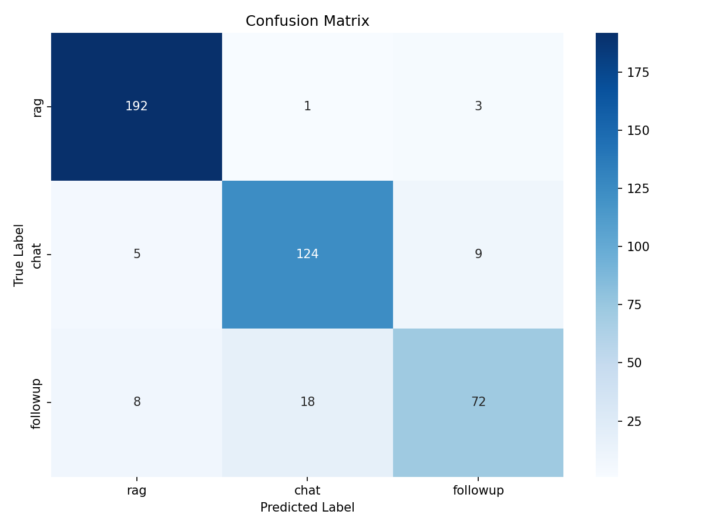

# Intent Classifier for RAG Chatbot

Fine-tuned **ruBERT-tiny2** model for classifying user messages into three intents: document search (rag), casual conversation (chat), and follow-up clarification (followup).

Built as a drop-in replacement for LLM API-based classification in a production Telegram RAG bot.

## Why This Exists

### The Problem

A RAG (Retrieval-Augmented Generation) chatbot needs to understand what the user wants before processing their message:

- **"какие условия возврата?"** → Search documents (rag)
- **"привет!"** → Just chat (chat)
- **"расскажи подробнее"** → Continue previous answer (followup)

The existing solution called an LLM API (120B parameter model) for every ambiguous message — just to get back one word. This costs money, adds 300-2000ms latency, depends on external API availability, and sends user data to third-party servers for a trivial classification task.

### The Solution

A fine-tuned 29M parameter BERT model that runs locally in 3.7ms on CPU. No API calls, no cost, no internet dependency.

```
BEFORE: User message → Internet → LLM API (120B params) → "rag" → 300-2000ms, $0.001
AFTER:  User message → Local model (29M params)          → "rag" → 3.7ms, $0
```

## Results

### Accuracy

| Class | Precision | Recall | F1-Score | Support |
|-------|-----------|--------|----------|---------|
| rag | 0.94 | 0.98 | 0.96 | 196 |
| chat | 0.87 | 0.90 | 0.88 | 138 |
| followup | 0.86 | 0.73 | 0.79 | 98 |
| **Overall** | | | **0.90** | **432** |

### Speed (CPU, Intel/AMD desktop)

| Metric | Value |
|--------|-------|
| Average | 3.7 ms |
| Median | 3.7 ms |
| P95 | 3.9 ms |
| P99 | 4.2 ms |

### Confusion Matrix



Key observations:
- **rag** is classified almost perfectly (192/196 correct)
- **chat** works well (124/138 correct), some confusion with followup
- **followup** is the weakest class (72/98 correct) — expected, as messages like "можно пример?" are ambiguous between chat and followup

## How It Works

### What is BERT?

BERT is a neural network that **understands** text (unlike ChatGPT which **generates** text). It reads a sentence and outputs a category — perfect for classification. The "tiny2" variant is a compact Russian-language BERT with 29M parameters (vs 120B in a typical LLM).

### Training Pipeline

```
1. DATASET CREATION
   ├── Seed examples extracted from existing bot regex patterns
   ├── Template-based expansion with proper Russian grammar
   ├── Augmentation (prefixes, punctuation, case variations)
   └── Result: 2,877 labeled examples (rag: 45%, chat: 32%, followup: 23%)

2. FINE-TUNING
   ├── Base model: cointegrated/rubert-tiny2 (pretrained on Russian text)
   ├── Added classification head: 3 output neurons (rag/chat/followup)
   ├── Training: 5 epochs, batch size 32, learning rate 2e-5
   ├── Hardware: Google Colab T4 GPU (free tier)
   └── Training time: ~2 minutes

3. EXPORT
   ├── PyTorch model → ONNX format (no PyTorch needed at runtime)
   └── Result: model.onnx (~111 MB) + tokenizer files (~2.4 MB)

4. INFERENCE
   ├── Load ONNX model with onnxruntime (~30 MB package)
   ├── Tokenize input text → numerical tokens
   ├── Run model → 3 logits → softmax → probabilities
   └── Return: label + confidence score in ~3.7ms
```

### Dataset Structure

Three classes with distinct characteristics:

| Class | Count | Examples |
|-------|-------|----------|
| **rag** | 1,309 | "какие условия возврата?", "найди в документе про сроки", "сколько стоит подписка?" |
| **chat** | 914 | "привет!", "что ты умеешь?", "спасибо", "как загрузить документ?" |
| **followup** | 654 | "расскажи подробнее", "а почему?", "можно пример?", "объясни проще" |

## Model

Trained ONNX model is hosted on HuggingFace Hub:
**[Gleckus/intent-classifier-rubert-tiny2](https://huggingface.co/Gleckus/intent-classifier-rubert-tiny2)**

## Quick Start

### Installation

```bash
pip install onnxruntime transformers huggingface-hub
```

### Download model

```bash
huggingface-cli download Gleckus/intent-classifier-rubert-tiny2 --local-dir model/
```

### Usage

```python
import numpy as np
import onnxruntime as ort
from transformers import AutoTokenizer

# Load once at startup
session = ort.InferenceSession("model/model.onnx")
tokenizer = AutoTokenizer.from_pretrained("Gleckus/intent-classifier-rubert-tiny2")

LABELS = ["rag", "chat", "followup"]

def classify(text: str) -> tuple[str, float]:
    """Classify user message. Returns (intent, confidence)."""
    inputs = tokenizer(
        text, return_tensors="np",
        padding="max_length", truncation=True, max_length=128,
    )
    outputs = session.run(None, {
        "input_ids": inputs["input_ids"],
        "attention_mask": inputs["attention_mask"],
    })
    logits = outputs[0][0]
    probs = np.exp(logits) / np.exp(logits).sum()
    pred_id = np.argmax(probs)
    return LABELS[pred_id], float(probs[pred_id])

# Example
label, confidence = classify("какие условия возврата товара?")
print(f"{label} ({confidence:.1%})")  # rag (91.2%)
```

### Integration with a chatbot

```python
# In your message handler:
intent, confidence = classify(user_message)

if intent == "rag":
    # Search documents and generate answer
    answer = rag_pipeline.query(user_message)
elif intent == "followup":
    # Continue previous conversation with context
    answer = generate_with_context(user_message, history)
else:
    # Chat mode — no document retrieval needed
    answer = generate_chat_response(user_message)
```

## Project Structure

```
intent-classifier/
├── README.md                  # This file
├── PROBLEM.md                 # Problem analysis and motivation
├── SOLUTION.md                # Technical solution design
├── model/                     # Trained ONNX model (ready to use)
│   ├── model.onnx             # Neural network weights
│   ├── model.onnx.data        # Weight data (external storage)
│   ├── tokenizer.json         # Tokenizer vocabulary
│   └── tokenizer_config.json  # Tokenizer settings
├── dataset.csv                # Training dataset (2,877 examples)
├── seeds.py                   # Seed examples for dataset generation
├── generate_dataset.py        # Dataset generation script
├── train.ipynb                # Google Colab training notebook
├── test_model.py              # Local inference test script
└── confusion_matrix.png       # Model evaluation results
```

## Technical Details

| Component | Choice | Why |
|-----------|--------|-----|
| Base model | cointegrated/rubert-tiny2 | Russian-specific, compact (29M params), proven for classification |
| Training framework | HuggingFace Transformers + Trainer | Industry standard, handles training loop, logging, checkpoints |
| Export format | ONNX | No PyTorch at runtime (saves ~2GB), cross-platform, fast |
| Runtime | onnxruntime | Lightweight (~30MB), optimized CPU inference |
| Dataset | Synthetic + template-based | Fast to create, sufficient for 3-class task |

## Comparison with LLM API

| Metric | LLM API (Cerebras/Claude) | Local ONNX Model |
|--------|---------------------------|-------------------|
| Latency | 300-2000 ms | **3.7 ms** |
| Cost per request | ~$0.001 | **$0** |
| Monthly cost (1K users) | ~$450 | **$0** |
| Internet required | Yes | **No** |
| Model size | 120B params (remote) | **29M params (111MB local)** |
| Failure modes | API down, rate limits, auth errors | **None (runs locally)** |
| Consistency | Varies between providers | **Deterministic** |
| Privacy | Data sent to third party | **Data stays local** |

## Future Improvements

- **More followup training data** — weakest class, needs more diverse examples
- **INT8 quantization** — reduce model size from 111MB to ~30MB
- **Confidence threshold** — fall back to LLM for low-confidence predictions
- **Active learning** — log production predictions, retrain on corrected labels
- **Token type IDs** — add segment embeddings for better context understanding

## How to Reproduce

1. Open `train.ipynb` in [Google Colab](https://colab.research.google.com/)
2. Upload `dataset.csv` to the Colab file panel
3. Select GPU runtime (Runtime → Change runtime type → T4 GPU)
4. Run all cells (Runtime → Run all)
5. Download the exported model

Total time: ~5-7 minutes. Cost: $0 (Colab free tier).

## Tech Stack

- Python 3.12
- HuggingFace Transformers (training)
- ONNX Runtime (inference)
- Google Colab (GPU compute)
- scikit-learn (evaluation metrics)
